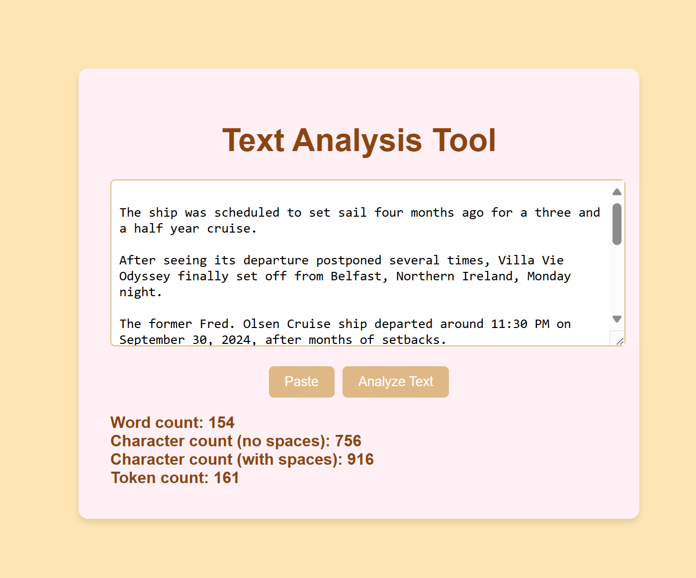

# Text Analysis Tool

A simple web-based tool that allows users to analyze text by providing the word count, character count (with and without spaces), and token count. This tool is built using HTML, CSS, and JavaScript.

## Features

- **Paste from Clipboard**: Allows users to quickly paste text from the clipboard using the browser's clipboard API.
- **Text Analysis**: Displays the word count, character count (with and without spaces), and token count for any given input text.
- **Responsive Design**: The interface is designed to work on various screen sizes and devices.

## Preview

  
*Example of the Text Analysis Tool interface*

## How to Use

1. **Enter Text**: Type or paste text into the provided textarea.
2. **Paste from Clipboard**: Use the "Paste" button to quickly paste any copied text from the clipboard.
3. **Analyze Text**: Click on the "Analyze Text" button to generate the analysis, which includes:
   - Word count
   - Character count (with and without spaces)
   - Token count (based on simple tokenization rules)

The analysis results will be displayed below the buttons.

## Technologies Used

- **HTML5**: For structuring the web page.
- **CSS3**: For styling the layout and making it visually appealing.
- **JavaScript**: To handle the text analysis logic and interact with the clipboard.

## Code Overview

- **HTML**: Defines the layout with a simple `textarea` input and buttons for pasting and analyzing text.
- **CSS**: Provides styling to create a user-friendly and visually appealing interface.
- **JavaScript**: Handles the core functionality of the text analysis tool, including:
  - Pasting text from the clipboard
  - Counting words, characters (with and without spaces), and tokens.

## Installation and Setup

To use this tool locally:

1. Clone the repository:

   ```bash
   git clone https://github.com/BranislavValacsay/text-analysis-tool.git
   
2. Open the index.html file in your browser.
   
That's it! You're ready to analyze text.

## License
This project is licensed under the [MIT](https://opensource.org/license/mit) License. See the LICENSE file for more details.
